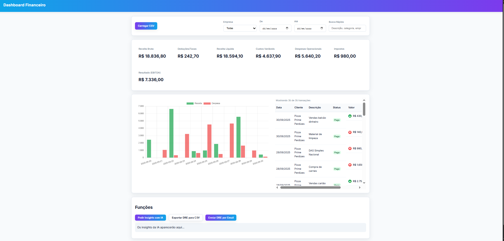

# Dashboard Financeiro Inteligente - Desafio Técnico Easely

### Uma SPA de análise financeira com backend de automação pragmático utilizando n8n.

Este projeto é a minha abordagem para o desafio técnico da Easely. Mais do que apenas um dashboard, é uma demonstração de como o desenvolvimento moderno pode ser acelerado para entregar valor de negócio rapidamente, combinando uma base de código sólida com ferramentas de automação inteligentes.

[➡️ Aceda à Demo Ao Vivo Aqui ⬅️](https://easely.netlify.app/)




---

## 💡 A Filosofia por Trás do Projeto: Entregar Valor, Rápido.

A minha abordagem para este desafio foi guiada por uma filosofia de desenvolvimento que acredito ser crucial para startups como a Easely: **tempo é o recurso mais valioso**. O papel de um desenvolvedor Pleno não é apenas escrever código, mas sim ser um arquiteto de soluções que encontra o caminho mais rápido para entregar valor ao negócio.

Por isso, a solução foi dividida em duas frentes estratégicas:

1.  **O Core da Aplicação (Frontend):** Onde a experiência do utilizador e a performance são críticas, construí uma base robusta com **JavaScript puro e modular**. O controlo total sobre o código aqui foi essencial para garantir uma interface reativa e manutenível.

2.  **O Cérebro da Automação (Backend):** Para funcionalidades como envio de emails, logging e geração de insights com IA, em vez de construir um backend do zero (o que levaria dias), optei por uma abordagem pragmática: utilizei o **n8n**. Esta decisão permitiu-me implementar um "backend" completo em horas, demonstrando a capacidade de integrar APIs e resolver problemas complexos de forma extremamente eficiente.

O resultado é uma aplicação que não só cumpre todos os requisitos, mas que foi construída numa fração do tempo tradicional, permitindo que o foco permaneça no que realmente importa: a solução para o cliente.

---

## 🚀 Funcionalidades

-   **Dashboard Interativo:** Interface limpa com cards de métricas, gráfico de Receitas vs. Despesas e tabela de transações.
-   **Upload e Parsing de CSV:** Leitura e processamento de arquivos `.csv` no lado do cliente com PapaParse.
-   **Filtros Dinâmicos:** Filtragem em tempo real por empresa, período de datas e busca textual.
-   **Cálculo de DRE:** Lógica de negócio explícita para o cálculo do Demonstrativo de Resultados.
-   **✨ Insights com IA:** Integração com o Google Gemini via n8n para gerar análises financeiras automáticas.
-   **⚡ Automação de Email:** Disparo de lembretes de cobrança e envio de relatórios DRE por email.
-   **📝 Logging Automático:** Registo de cada cobrança enviada numa planilha do Google Sheets para fins de auditoria.
-   **UX Refinada:** Feedback de loading nos botões e sistema de notificações não intrusivo.

---

## 🛠️ Tecnologias Utilizadas

-   **Frontend:** HTML5, CSS3, JavaScript (ES6+), Chart.js, PapaParse.
-   **Backend & Automação:** n8n.
-   **Serviços Integrados:** Gmail API, Google Sheets API, Google Gemini.
-   **Hospedagem:** Netlify.

---

## ⚙️ Como Rodar o Projeto

A forma mais simples de rodar este projeto é utilizando a extensão **Live Server** no Visual Studio Code.

1.  **Clone o repositório:**
    ```bash
    git clone [URL_DO_SEU_REPOSITORIO]
    ```
2.  **Abra no VS Code** e clique com o botão direito no arquivo `index.html`.
3.  Selecione a opção **"Open with Live Server"**.

O projeto será aberto automaticamente no seu navegador padrão, pronto para ser utilizado.

---

## 🏛️ Arquitetura e Decisões de Design

A aplicação foi estruturada com base no **Princípio da Responsabilidade Única**, onde cada módulo tem uma função clara e específica:

-   `main.js`: O **orquestrador** que gere o estado da aplicação e coordena a comunicação entre os módulos.
-   `ui.js`: O único módulo responsável por **manipular o DOM**. Ele desenha a interface, mas não contém lógica de negócio.
-   `data.js`: Responsável por **tratar os dados brutos** do CSV, normalizando-os para um formato consistente.
-   `dre.js`: Contém a **lógica de negócio pura** para o cálculo do DRE, isolada de qualquer outra parte do sistema.
-   `api.js`: Abstrai todas as **chamadas de rede externas**, tornando a comunicação com o n8n simples e centralizada.

---

## 📊 Como o DRE é Calculado

A lógica de cálculo do DRE é explícita e baseada em palavras-chave presentes na coluna `categoria` do CSV.

-   O DRE considera apenas transações com o status `pago`.
-   **Custos Variáveis:** Incluem categorias como `fornecedor`, `insumos`, `comissões`, `embalagens`, etc.
-   **Despesas Operacionais:** Incluem categorias como `aluguel`, `utilidades`, `sistemas`, `marketing`, `folha`, etc.
-   Qualquer despesa não reconhecida é, por segurança, classificada como **Despesa Operacional**.

---

## ⚡ As Automações em Ação (Integração n8n)

A aplicação comunica com o n8n através de webhooks para executar tarefas de backend.

#### 1. Disparo de Lembrete de Cobrança

-   **Ação:** Clique no botão "Disparar" numa transação com status "previsto".
-   **Payload Enviado:**
    ```json
    {
      "type": "simulate_charge",
      "data": {
        "date": "2025-09-27T03:00:00.000Z",
        "company": "Bar do Alemão",
        "category": "Folha",
        "type": "despesa",
        "value": 4200,
        "description": "Salários",
        "status": "previsto"
      }
    }
    ```
-   **Workflow n8n:** Recebe os dados, formata um email de cobrança em HTML e o envia via Gmail, registando a ação numa planilha do Google Sheets.

#### 2. Envio de Relatório DRE por Email

-   **Ação:** Clique no botão "Enviar DRE por Email".
-   **Payload Enviado:**
    ```json
    {
      "type": "dre_report",
      "data": {
        "dre": {
          "receitaBruta": 17586.80,
          "deducoesTaxas": 242.70,
          "resultadoEBITDA": 6086.00
        },
        "filters": {
          "company": "all",
          "from": "N/A",
          "to": "N/A"
        }
      }
    }
    ```
-   **Workflow n8n:** Recebe o DRE e os filtros, cria um título e corpo de email dinâmicos (que se adaptam se houver filtros) e envia um relatório formatado em HTML.

---

## 🚧 Limitações e Próximos Passos

-   **Limitação (Performance):** A aplicação funciona 100% no cliente. Arquivos CSV muito grandes podem impactar a performance do navegador.
-   **Próximo Passo (Escalabilidade):** Mover o processamento do CSV para um backend dedicado (ex: Node.js/Python) para suportar maiores volumes de dados.
-   **Próximo Passo (Configurações na UI):** Criar uma aba de "Configurações" na interface para que o utilizador possa definir o seu próprio email de destino ou número de telefone para as automações, em vez de estarem fixos no n8n.
-   **Próximo Passo (Integração com WhatsApp):** Expandir a automação de lembretes para o WhatsApp utilizando a API oficial do WhatsApp Business. A arquitetura com o n8n já facilita a adição de um novo "nó" para esta funcionalidade.
